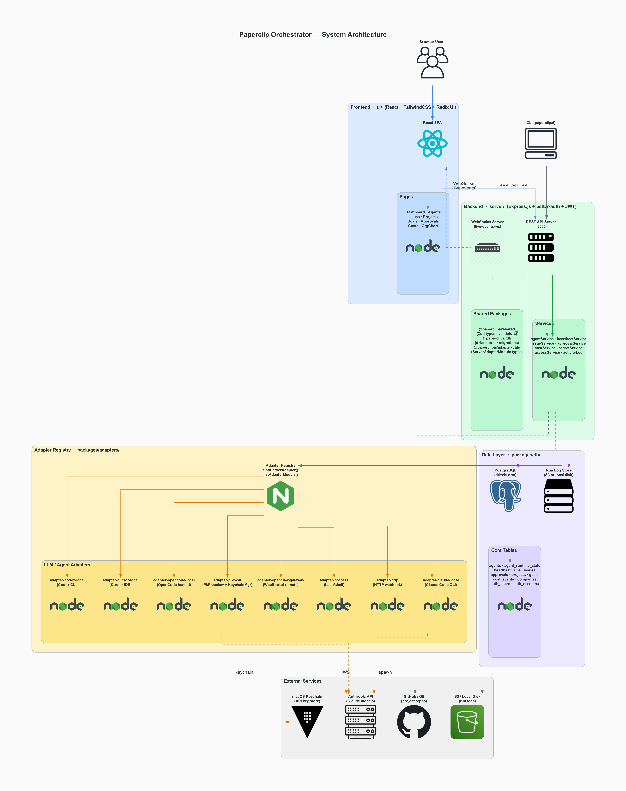
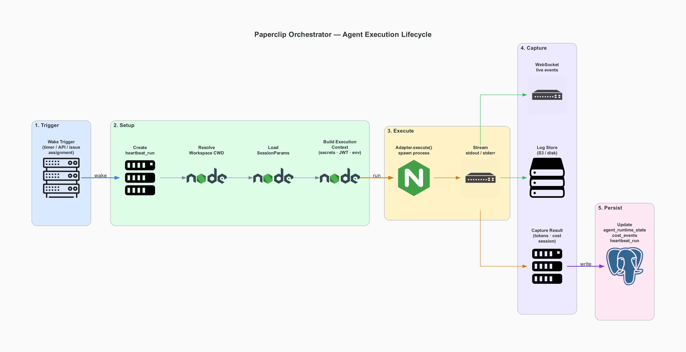

# Paperclip Orchestrator — System Architecture

> Generated: 2026-03-10
Browser
   │
   ▼
Dev Server (Vite)
   │
   ├── Adapter UI modules
   │
   ▼
Agent Platform API
   │
   ├── companies
   ├── agents
   ├── issues
   ├── live runs
   │
   ▼
Agent runtimes
   ├── Claude
   ├── Codex
   ├── Cursor
   ├── OpenClaw
   └── Pi Agent
---

## System Architecture Overview



**PDF version:** [paperclip-architecture.pdf](./paperclip-architecture.pdf)

---

## Agent Execution Lifecycle



**PDF version:** [paperclip-lifecycle.pdf](./paperclip-lifecycle.pdf)

---

## Layers

### 1. Frontend — `ui/`

| Component | Technology | Purpose |
|-----------|-----------|---------|
| React SPA | React + TailwindCSS + Radix UI | Dashboard, agent management, issue tracking |
| API Client | React Query (`@tanstack/react-query`) | Server-state fetching & caching |
| Live Events | WebSocket client | Real-time stdout/stderr streaming from agent runs |
| Adapter UI | Per-adapter `./ui` exports | Config forms, transcript parsers per agent type |

**Pages:** Dashboard · Agents · Issues · Projects · Goals · Approvals · Costs · OrgChart · Activity · Inbox

---

### 2. Backend — `server/`

| Component | Technology | Purpose |
|-----------|-----------|---------|
| REST API | Express.js | All CRUD routes: `/agents`, `/issues`, `/approvals`, `/projects`, `/goals`, `/companies`, `/costs`, `/secrets`, `/llms` |
| WebSocket | `live-events-ws.ts` | Real-time event streaming scoped by company |
| Auth | better-auth + JWT | Session validation; local JWT for agent → server callbacks |
| Services | `services/` | Business logic: agentService, heartbeatService, issueService, approvalService, costService, secretService, accessService, activityLogService |

---

### 3. Adapter System — `packages/adapters/`

The adapter registry exposes a unified `ServerAdapterModule` interface:

```typescript
interface ServerAdapterModule {
  type: string;
  execute(ctx: AdapterExecutionContext): Promise<AdapterExecutionResult>;
  testEnvironment(ctx): Promise<AdapterEnvironmentTestResult>;
  sessionCodec?: AdapterSessionCodec;
  supportsLocalAgentJwt?: boolean;
  listModels?: () => Promise<AdapterModel[]>;
  onHireApproved?: (payload, config) => Promise<HireApprovedHookResult>;
}
```

| Adapter | Binary / Target | Provider |
|---------|----------------|---------|
| `adapter-claude-local` | `claude` CLI | Anthropic (Claude Code) |
| `adapter-codex-local` | `codex` CLI | OpenAI Codex |
| `adapter-cursor-local` | Cursor IDE | Cursor |
| `adapter-opencode-local` | OpenCode hosted | Configurable |
| `adapter-pi-local` | `pi` / picoclaw | Multi-provider (default: `anthropic/claude-sonnet-4-5`) |
| `adapter-openclaw-gateway` | WebSocket gateway | Remote agents |
| `adapter-process` | Any shell command | Generic |
| `adapter-http` | HTTP webhook | External services |

**`adapter-pi-local` key detail:** Uses `token-manager.ts` to auto-inject `ANTHROPIC_API_KEY` from the macOS keychain (`Claude Code` keychain service) when running with the `anthropic` provider.

---

### 4. Data Layer — `packages/db/`

**Database:** PostgreSQL via [drizzle-orm](https://orm.drizzle.team)

#### Core Tables

| Table | Purpose |
|-------|---------|
| `agents` | Agent definitions: id, companyId, name, role, adapterType, adapterConfig, budgetMonthlyCents |
| `agent_runtime_state` | Live state: sessionId, sessionParams, tokenUsage, totalCostCents, lastError |
| `agent_config_revisions` | Immutable config snapshots for rollback |
| `heartbeat_runs` | Execution records: status, exitCode, usageJson, logRef, startedAt, finishedAt |
| `heartbeat_run_events` | Detailed per-run events (stdout, stderr, init, result) |
| `agent_wakeup_requests` | Queued wake triggers with idempotency keys |
| `issues` | Work items: status, priority, assigneeAgentId, checkoutRunId |
| `approvals` | Workflow approvals: hire_agent, admin_action |
| `projects` | Business projects with git workspace links |
| `goals` | Strategic / quarterly / sprint goals |
| `cost_events` | Per-run cost records for billing |
| `companies` / `company_memberships` | Multi-tenant isolation |
| `auth_users` / `auth_sessions` | User authentication (better-auth) |
| `company_secret_versions` | Versioned encrypted secrets |
| `principal_permission_grants` | RBAC permission grants |

**Run Log Store:** Streams stdout/stderr to S3 or local disk during execution. Referenced via `logRef` in `heartbeat_runs`.

---

### 5. Shared Packages

| Package | Role |
|---------|------|
| `@paperclipai/shared` | Domain types, Zod validators, constants (used by server + UI + CLI) |
| `@paperclipai/db` | PostgreSQL schema, migrations, backup/restore utilities |
| `@paperclipai/adapter-utils` | `ServerAdapterModule` interface, `AdapterExecutionContext`, `AdapterExecutionResult` |

---

### 6. CLI — `cli/`

The `paperclipai` binary supports:

| Command | Purpose |
|---------|---------|
| `onboard` | Interactive first-run setup wizard |
| `doctor` | Runs `testEnvironment()` on all adapters, reports health |
| `configure` | Update configuration sections |
| `db:backup` | One-off database snapshot |
| `agent *` | Agent CRUD via REST API |
| `issue *` | Issue management via REST API |
| `approval *` | Approval workflow via REST API |

---

## Agent Execution Lifecycle

```
1. TRIGGER
   ├── Scheduled timer (intervalSec in agent config)
   ├── On-demand: POST /agents/{id}/wake
   └── Automation: issue assignment, approval completion

2. SETUP
   ├── INSERT heartbeat_run (status=queued → running)
   ├── Resolve workspace CWD
   │     ├── project_workspaces (if issue assigned)
   │     └── ~/.paperclip/agents/{agentId} (default)
   ├── Load agent_runtime_state.sessionParams
   └── Build ExecutionContext
         ├── Inject secrets (from company_secret_versions)
         ├── Generate local JWT (if supportsLocalAgentJwt)
         └── Merge env vars (config + secrets + PAPERCLIP_*)

3. EXECUTE
   ├── adapter.execute(context) → spawn child process
   └── Stream stdout/stderr chunks (every 8KB)
         ├── WebSocket broadcast (scoped to company)
         └── Run log store (S3 key or local path)

4. CAPTURE
   ├── AdapterExecutionResult: exitCode, usage, sessionParams, costUsd
   └── parsePiJsonl / parseClaudeJsonl (adapter-specific stdout parsing)

5. PERSIST
   ├── UPDATE agent_runtime_state (sessionId, tokenUsage, lastError)
   ├── UPDATE heartbeat_run (status=finished, usageJson, resultJson, logRef)
   └── INSERT cost_events (provider, model, costCents)
```

---

## External Integrations

| Service | Purpose | How |
|---------|---------|-----|
| **Anthropic API** | Claude LLM inference | Via `claude` CLI or `pi`/picoclaw with `ANTHROPIC_API_KEY` |
| **macOS Keychain** | API key auto-injection | `security find-generic-password -s "Claude Code"` in `token-manager.ts` |
| **GitHub / Git** | Project workspace source | `project_workspaces.repoUrl` cloned to `cwd` |
| **S3 / Local Disk** | Run log persistence | Streamed during execution, referenced by `logRef` |
| **SMTP / OAuth** | User authentication | better-auth providers |

---

## Package Dependency Graph

```
server
├── @paperclipai/db
├── @paperclipai/shared
├── @paperclipai/adapter-utils
├── @paperclipai/adapter-claude-local
├── @paperclipai/adapter-codex-local
├── @paperclipai/adapter-cursor-local
├── @paperclipai/adapter-opencode-local
├── @paperclipai/adapter-pi-local          ← token-manager (keychain)
├── @paperclipai/adapter-openclaw-gateway
└── (process + http adapters built-in)

ui
├── @paperclipai/adapter-utils
├── @paperclipai/shared
└── @paperclipai/adapter-*/ui              ← per-adapter config forms

cli
├── server (embedded startup)
├── @paperclipai/db
├── @paperclipai/shared
└── @paperclipai/adapter-*               ← for doctor checks
```

---

## Key Design Patterns

| Pattern | Description |
|---------|-------------|
| **Multi-tenancy** | All entities scoped by `companyId`; queries filtered in middleware |
| **Pluggable Adapters** | Uniform `ServerAdapterModule` interface; register new adapters without touching core |
| **Event-Driven** | Heartbeat runs emit events; WebSocket broadcasts; activity log tracks mutations |
| **Approval Workflow** | Agent hire, admin actions require explicit approval before execution |
| **Cost Control** | Per-agent monthly budgets; cost events recorded per run; budget enforcement |
| **Config Versioning** | Immutable `agent_config_revisions` snapshots; rollback support |
| **Session Persistence** | `sessionParams` stored per agent; workspace-aware session migration |
| **Deferred Wakeup** | Agent can queue wakeup of another agent via `_paperclipWakeContext` payload |
