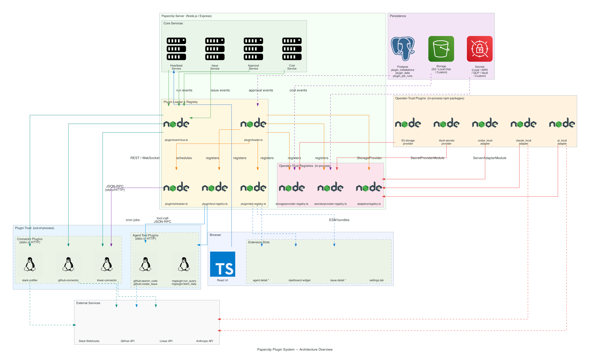
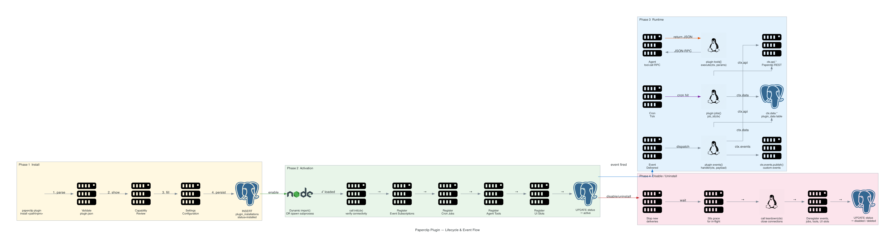
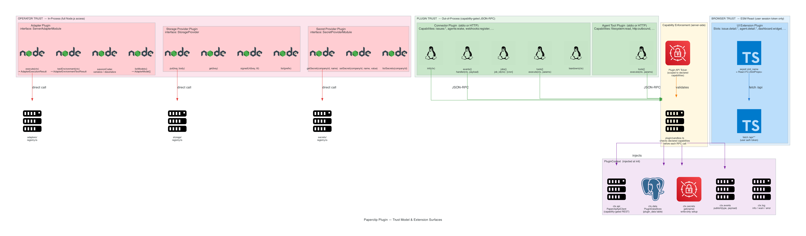

# Paperclip Plugin System — Architecture Diagrams

Generated: 2026-03-10
Source: [doc/plugins/PLUGIN_GUIDE.md](../../doc/plugins/PLUGIN_GUIDE.md)

---

## Diagram 1 — Plugin System Architecture Overview

Shows all plugin classes, how they connect to Paperclip core services, and the path from the browser through the server to external systems.



**Downloads:** [PNG](plugin-architecture.png) · [PDF](plugin-architecture.pdf)

### Reading guide

| Color | Meaning |
|---|---|
| Red edges | Operator-trust (in-process) plugin registration |
| Green edges | Event bus delivery to connector plugins |
| Blue edges | JSON-RPC tool calls to agent tool plugins |
| Orange edges | Plugin loader registering extension surfaces |
| Purple edges | Persistence layer connections |

**Left-to-right flow:**
1. Browser UI connects via REST/WebSocket to Paperclip core services.
2. Core services emit typed events onto the event bus.
3. The plugin loader registers operator-trust adapters, storage, and secret providers directly into the respective registries.
4. Connector and agent tool plugins receive events and tool calls out-of-process via JSON-RPC (stdio or HTTP).
5. UI extension bundles are loaded from the slot registry into React extension slots in the browser.
6. Persistence (Postgres, S3/storage, secrets) is shared between core and plugins via scoped interfaces.

---

## Diagram 2 — Plugin Lifecycle & Event Flow

Shows the complete lifecycle of an out-of-process connector plugin from installation to uninstall, and the three runtime paths: event delivery, cron job execution, and agent tool calls.



**Downloads:** [PNG](plugin-lifecycle.png) · [PDF](plugin-lifecycle.pdf)

### Reading guide

| Phase | Color | Description |
|---|---|---|
| Phase 1 — Install | Yellow | `plugin.json` validation, capability review, settings configuration, DB record creation |
| Phase 2 — Activation | Green | Module load or subprocess spawn, `init()` call, event/job/tool/UI slot registration |
| Phase 3 — Runtime | Blue | Event delivery → handler, cron tick → job, agent tool call → execute |
| Phase 4 — Disable/Uninstall | Red | Stop deliveries, 30s grace, `teardown()`, deregister, DB cleanup |

**Key runtime paths (Phase 3):**

```
Core event fires
  → event-bus.ts dispatches to subscribed plugins
    → plugin events{} handler(ctx, payload)
      → ctx.api.* (REST calls back to Paperclip)
      → ctx.data.* (plugin_data table read/write)
      → ctx.events.publish() (plugin-to-plugin events)

Cron tick
  → scheduler.ts fires job by ID
    → plugin jobs{} job_id(ctx)
      → ctx.api.* / ctx.data.*

Agent run reaches a tool call
  → tool-registry.ts dispatches via JSON-RPC
    → plugin tools[] execute(ctx, params)
      → returns JSON result to agent
```

---

## Diagram 3 — Trust Model & Extension Surfaces

Shows the three trust levels (operator, plugin, browser), the interfaces each plugin class must implement, and how the capability gate enforces permissions for out-of-process plugins.



**Downloads:** [PNG](plugin-trust-surfaces.png) · [PDF](plugin-trust-surfaces.pdf)

### Reading guide

| Trust Zone | Background | Access Model |
|---|---|---|
| **Operator Trust** (red) | Pink | In-process Node.js; direct call into registries; no capability sandbox; operator assumes full responsibility |
| **Plugin Trust** (green) | Green | Out-of-process; all communication via JSON-RPC; capability declarations in `plugin.json` enforced server-side by `plugin/sandbox.ts` |
| **Browser Trust** (blue) | Blue | ESM React in browser; calls Paperclip REST API using the logged-in user's session token; no additional privileges |

### Capability enforcement detail

```
plugin.json declares:
  "capabilities": ["issues:read", "issues:write", "agent_tools:contribute"]

At runtime:
  Plugin calls → cap_gate checks declared capabilities
    → Allowed: issue read/write API endpoints, tool registration
    → Blocked: agent wake, approval decisions, secrets:read_own (not declared)
    → Plugin API token is scoped — not a full admin token
```

### Interface quick reference

| Class | Interface | Key methods |
|---|---|---|
| Adapter | `ServerAdapterModule` | `execute()`, `testEnvironment()`, `sessionCodec`, `listModels()` |
| Storage Provider | `StorageProvider` | `put()`, `get()`, `signedUrl()`, `list()`, `delete()` |
| Secret Provider | `SecretProviderModule` | `getSecret()`, `setSecret()`, `listSecrets()`, `deleteSecret()` |
| Connector | `ConnectorPlugin` | `init()`, `events{}`, `jobs{}`, `tools[]`, `teardown()` |
| Agent Tool | `AgentToolPlugin` | `tools[]` each with `execute(ctx, params)` |
| UI Extension | `UIExtensionPlugin` | Named exports matching slot IDs (underscored) |

---

## File Index

| File | Format | Description |
|---|---|---|
| [plugin-architecture.png](plugin-architecture.png) | PNG 938 KB | System overview — all plugin types and connections |
| [plugin-architecture.pdf](plugin-architecture.pdf) | PDF 128 KB | System overview — print/vector quality |
| [plugin-lifecycle.png](plugin-lifecycle.png) | PNG 787 KB | Plugin lifecycle phases and runtime event/job/tool flows |
| [plugin-lifecycle.pdf](plugin-lifecycle.pdf) | PDF 114 KB | Lifecycle diagram — print/vector quality |
| [plugin-trust-surfaces.png](plugin-trust-surfaces.png) | PNG 824 KB | Trust model, interface surfaces, capability gate |
| [plugin-trust-surfaces.pdf](plugin-trust-surfaces.pdf) | PDF 137 KB | Trust model — print/vector quality |

---

## Regenerating diagrams

The diagrams are generated from Python scripts using the `diagrams` library.

```bash
# Prerequisites (macOS)
brew install graphviz
pip3 install diagrams

# Regenerate all plugin diagrams
python3 docs/architecture/generate_plugin_diagrams.py
```

See also the full system architecture diagrams in this directory:
- [paperclip-architecture.png](paperclip-architecture.png) — full system overview
- [paperclip-lifecycle.png](paperclip-lifecycle.png) — agent execution lifecycle
